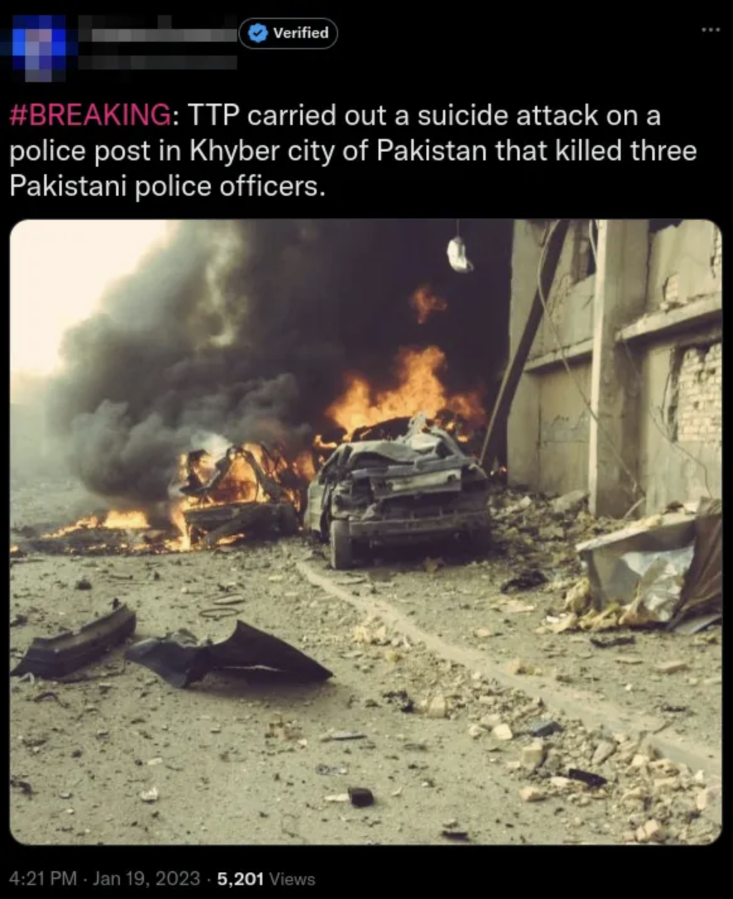
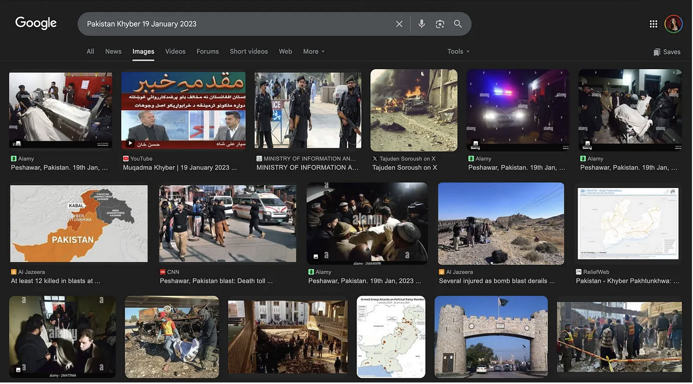
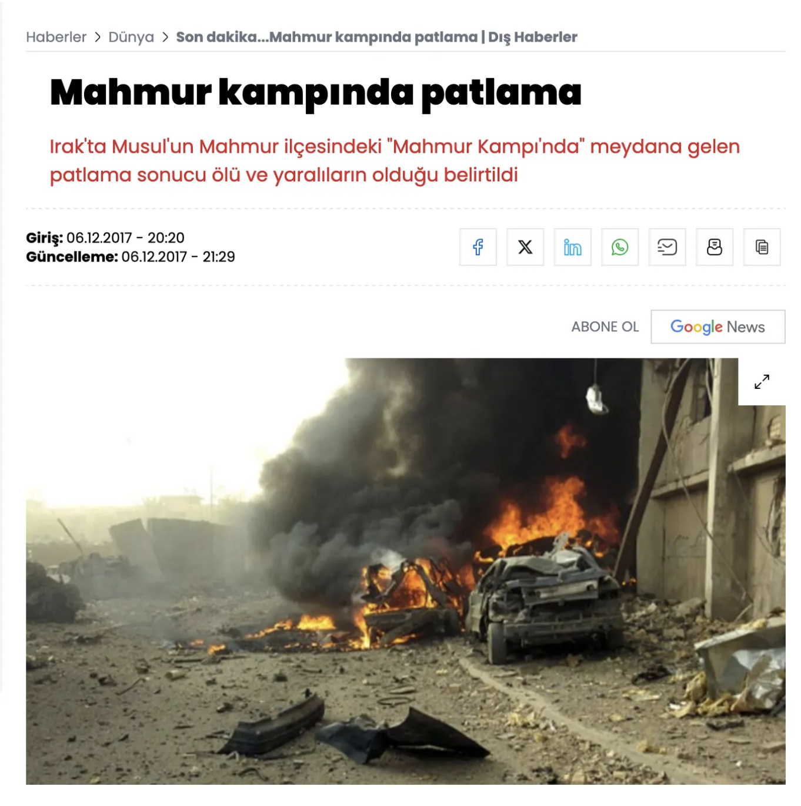
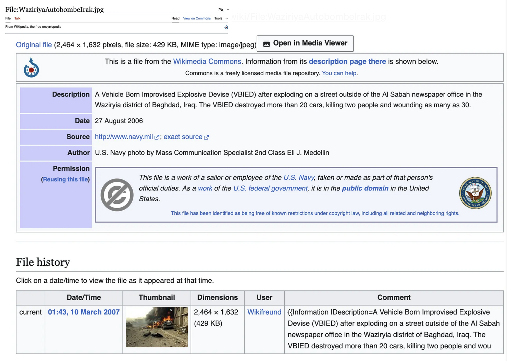
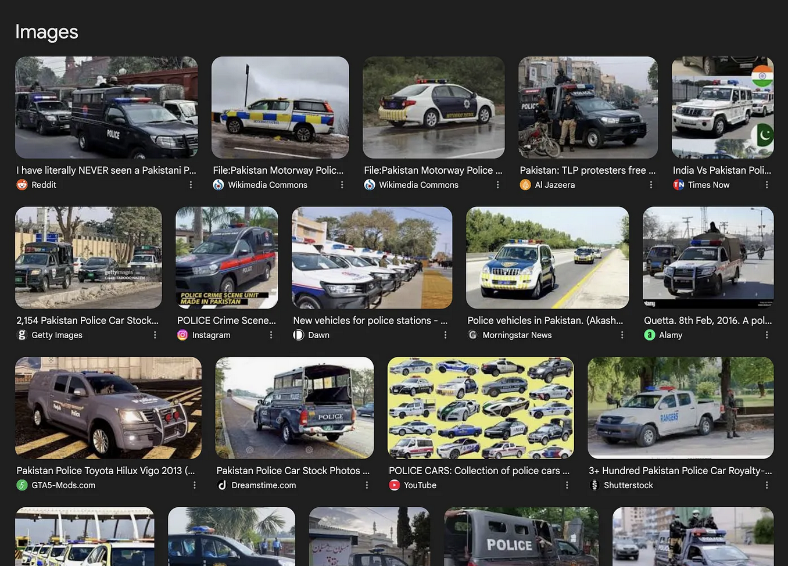
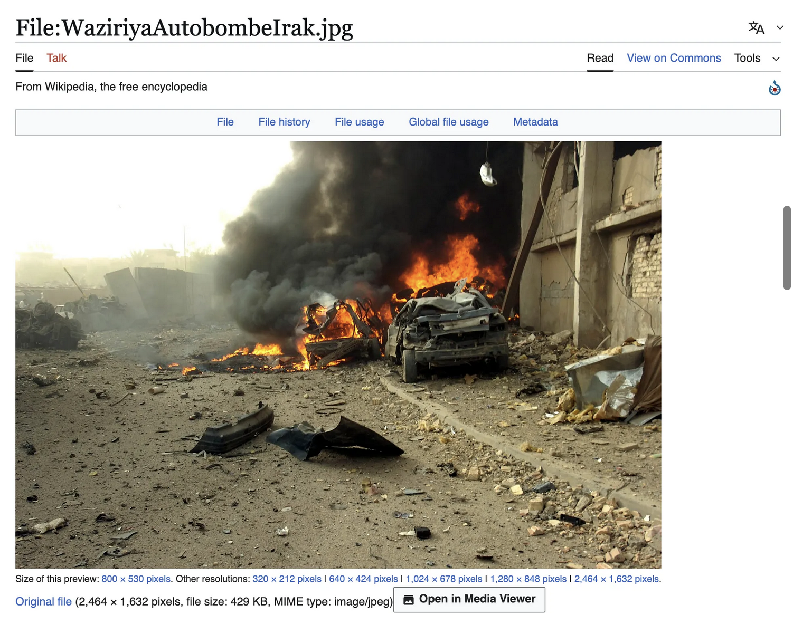

# Disinformation Analysis: The Power of Image Verification in OSINT

> **OSINT Exercise #006** - Image Verification Case Study  
> Original exercise designed by [Sofia Santos (gralhix.com)](https://gralhix.com)

---

## 📋 Table of Contents

- [Overview](#overview)
- [Exercise Scenario](#exercise-scenario)
- [Key Findings](#key-findings)
- [Vehicle Analysis](#vehicle-analysis)
- [Conclusion](#conclusion)
- [Tools & Techniques](#tools--techniques)
- [Credits](#credits)

---

## Overview

This analysis demonstrates a real-world case of image-based disinformation, where a photograph from one conflict zone was falsely repurposed to illustrate an unrelated incident in another country. This case study highlights the critical importance of image verification in OSINT investigations.

---

## Exercise Scenario

### The Claim

A Twitter post dated **January 19, 2023** claimed to show:

- **Location**: Khyber, Pakistan
- **Incident**: TTP suicide attack targeting a police post
- **Casualties**: 3 Pakistani police officers killed
- **Evidence**: Graphic image showing destroyed vehicle, smoke, and debris

**Question**: Is this photograph genuinely from Pakistan and the described incident?


*The viral tweet claiming to show a TTP attack in Pakistan*

---

## Key Findings

### Image Origin Identified

Through reverse image search and news archive research, the image was **definitively traced** to:

- **Actual Location**: Mahmur refugee camp near Mosul, **Iraq**
- **Actual Date**: **December 2017**
- **Actual Incident**: Explosion at refugee camp
- **Connection to Pakistan claim**: **NONE**


*Reverse image search revealing the true origin of the photograph*

### Evidence

Multiple news outlets documented this photograph as evidence of the December 2017 explosion in Iraq, with **no relevance to Pakistan** or the TTP attack cited in the tweet.


*News articles from December 2017 documenting the Iraq incident*


*Wikipedia entry confirming the image origin*

**Source Verification**:
- [Wikipedia Documentation](https://en.wikipedia.org/wiki/File:WaziriyaAutobombeIrak.jpg)
- International news archives from December 2017
- Iraq conflict documentation databases

---

## Vehicle Analysis

### Pakistani Police Vehicle Characteristics:

Pakistani police vehicles typically feature:

- ✅ **Colors**: White or dark blue/black
- ✅ **Markings**: Clear police insignias in English or Urdu
- ✅ **Equipment**: Emergency light bars (red/blue)
- ✅ **Livery**: Official blue-and-red color scheme
- ✅ **Identification**: Department name and badge numbers


*Examples of authentic Pakistani police vehicles with proper markings*

### Vehicle in the Viral Image:

- ❌ **No police markings**
- ❌ **No emergency equipment**
- ❌ **No official livery**
- ❌ **Appears to be civilian vehicle**
- ❌ **Lacks any Pakistani police identifiers**


*Comparison between the viral image vehicle and actual Pakistani police vehicles*

**Conclusion**: The vehicle characteristics further confirm this is **not** from a Pakistani police context.

---

## Conclusion

### Key Takeaways:

1. **Always verify imagery** before sharing, especially in crisis or conflict reporting
2. **Reverse image search** is a fundamental OSINT verification technique
3. **Context matters** - check vehicle markings, language, environmental clues
4. **Critical thinking** is essential when consuming information online
5. **Misinformation spreads** through the reuse of genuine images in false contexts

### Impact:

This case demonstrates a common disinformation tactic where **authentic images from one event are deliberately misattributed to fabricate or exaggerate another event**, potentially:

- Inflaming tensions
- Spreading false narratives
- Undermining legitimate reporting
- Manipulating public opinion

---

## 🛠️ Tools & Techniques

### Recommended OSINT Tools:

| Tool | Purpose | URL |
|------|---------|-----|
| Google Images | Reverse image search | images.google.com |
| TinEye | Reverse image search | tineye.com |
| Yandex Images | Reverse image search | yandex.com/images |
| InVID/WeVerify | Video/image verification | invid-project.eu |
| FotoForensics | Image metadata analysis | fotoforensics.com |

### Best Practices:

- Use multiple reverse image search engines
- Check image metadata (EXIF data)
- Verify through multiple independent sources
- Cross-reference dates and locations
- Look for visual inconsistencies

---

## Credits

- **Exercise Design**: [Sofia Santos](https://gralhix.com)
- **OSINT Exercises**: [gralhix.com](https://gralhix.com)
- **Walkthrough**: irlinya

---

## Related Resources

- [OSINT Framework](https://osintframework.com/)
- [Bellingcat's Online Investigation Toolkit](https://bit.ly/bcattools)
- [First Draft's Visual Verification Guide](https://firstdraftnews.org/)

---

## License

This analysis is shared for educational purposes. All credit for the original exercise goes to Sofia Santos.

---

## 📁 Repository Structure

```
osint-image-verification/
│
├── README.md (this file)
│
└── images/
    ├── original-tweet.png              # The viral tweet screenshot
    ├── reverse-search-results.png      # Reverse image search results
    ├── news-archive.png                # News articles from Dec 2017
    ├── wikipedia-source.png            # Wikipedia documentation
    ├── pakistani-police-vehicles.png   # Real Pakistani police vehicles
    └── vehicle-comparison.png          # Side-by-side comparison
```

**Note**: Add your screenshots to the `images/` folder with the filenames listed above.

---

**Tags**: `#OSINT` `#Disinformation` `#ImageVerification` `#FactChecking` `#CyberSecurity` `#DigitalForensics`

---

*Last Updated: March 2026*
